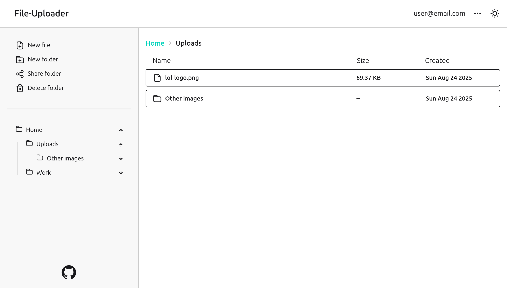

# file-uploader

A file-hosting service for images.
Built with Express, Postgres, Prisma, Tailwind and DaisyUI.

Service hosted on [Render](https://render.com/)

Database and files hosted on [Supabase](https://supabase.com)

**[file-uploader-prod.onrender.com](https://file-uploader-prod.onrender.com)**
[](https://file-uploader-prod.onrender.com)

## About

This project was made for the Odin Project [NodeJS course](https://www.theodinproject.com/lessons/nodejs-file-uploader)

## Features

- **Image hosting** : Upload image files up to a size of 5MB.
- **Folder management** : Create folders to organize your files.
- **Folder sharing** : You can share folders with others by generating public links valid for a given duration.
- **Drag and drop** : You can move around your files and folders easily using the drag and drop functionality.
- **Security** : Uploaded files are checked to prevent common vulnerabilities. Including file type checking using [file-type](https://www.npmjs.com/package/file-type) and file name sanitizing using [sanitize-filename](https://www.npmjs.com/package/sanitize-filename).

## Setup

### Requirements

You will need to setup a Postgres database to run this project locally.
Your database must contain a schema named `file_uploader`.

### Environment variables

Here are the required variables for your .env file.

```js
PASSWORD_SALT_LENGTH = // Password salt length used when generating encrypted password for users
SESSION_SECRET = // A string to be used as session secret
DATABASE_URL = // Connection string to a Postgres database and pointing to the schema file_uploader
FILES_DATA_PATH = // Optional path where to store uploaded images locally instead of a storage bucket
STORAGE_STRATEGY = // Use value "supabase" to host images in a storage bucket or "local" locally at FILES_DATA_PATH
SUPABASE_URL = // Url to your supabase bucket if needed
SUPABASE_KEY = // Key of your supabase bucket
SUPABASE_FILES_BUCKET = // Name of your subabase bucket
```

### Installation

1. Clone the repository

    ```bash
    git clone https://github.com/arnaudSanchez1816/file-uploader.git
    ```

2. Install NPM packages

    ```bash
    npm install
    ```

3. Setup your database

    ```bash
    npx prisma db push
    ```

4. Build project

    ```bash
    npm run build
    ```

5. Run the project

    ```bash
    npm run start
    ```
